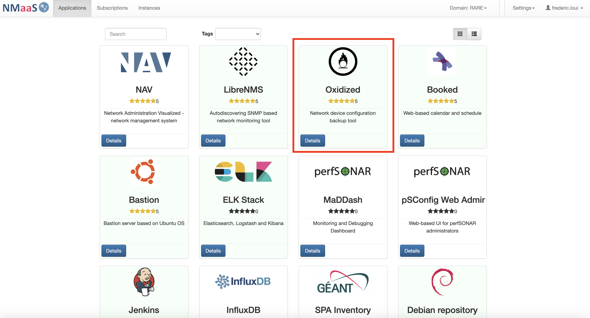

# [ #003 ] NMaaS-101 - "My name is Oxidized and I'm a nifty configuration management tool"

In article [#001](https://docs.nmaas.eu/blog/blog1/nmaas-101-1/#overview) and [#002](https://docs.nmaas.eu/blog/blog2/nmaas-101-2/#overview) you essentially created a NMaaS domain and enabled connectivity between your dedicated and isolated domain to your out of band management equipment network.

<h3 style="margin: 0.6em 0 0.4em;">Requirements</h3>
<li>Completed #001</li> 
<li>Completed #002</li>
<li>Basic knowledge related to configuration management</li>

## Overview

We are going to deploy our first NMaaS service for your organisation: Oxidized

## Article objective

This is done in 2 steps:

- Oxidized application deployment via the NMaaS portal
- Oxidized configuration specific to RARE domain

## Diagram

NMaaS portal: Oxidized

## [#003] - Cookbook

Pré-requisites

<li> Having completed <a href="https://docs.nmaas.eu/blog/blog1/nmaas-101-1/#overview">#001</a> </li>

<li> Having completed <a href="https://docs.nmaas.eu/blog/blog2/nmaas-101-2/#overview">#002</a></li>

Oxidized application deployment

<li>Once your domain is created and associated to your account, log into <a href="https://nmaas.eu">https://nmaas.eu</a> as in <a href="https://docs.nmaas.eu/blog/blog1/nmaas-101-1/#overview">#001</a>  </li>

<li>select Oxidized application </li>

<li>select "Deploy" </li>

<li>choose a name for your service instance, in our case we chose: "p4-oxi-srv" </li>

The name has a particular importance as it will dynamically create a FQDN for the NMaaS service in the form: <b><service_name>.<domain>.nmaas.eu </b>

In my example it is: <b>oxidized.rare.nmaas.eu</b>

<li>fill in the mandatory basic configuration information</li>

<li>Oxidized access username</li>
we chose: oxidized

<li>Oxidized access password</li>
we chose: oxidized

<li>Device access username (login used by Oxidized to access the equipment via SSH)</li>
we chose: rare

<li>Device access password (password used to access the equipment via SSH)</li>
we chose: rare

<li>Device (IP address)</li>
we chose: 172.16.26.103,172.16.26.105,172.16.26.108,172.16.26.109 

<h4>VPN Connectivity Warning</h4>

 It is important to note that you'll be connected inside a dedicated VPN so you'll be isolated from the outside world as if you were running your own Out of band management network. So we can assume that your domain is secured.

<li>Congratulation. You should have completed Oxidized deployment</li>

