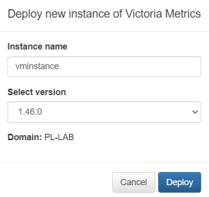
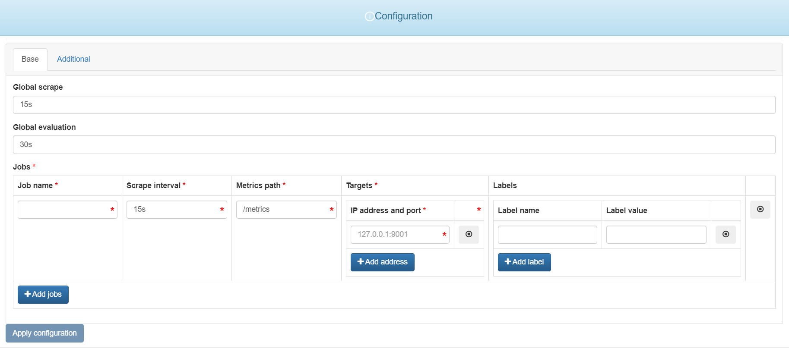
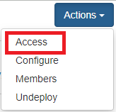
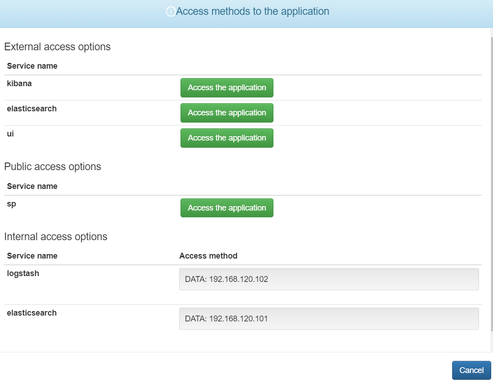
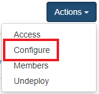
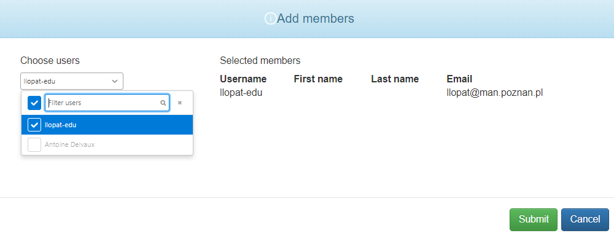
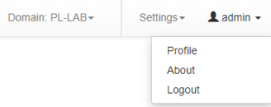
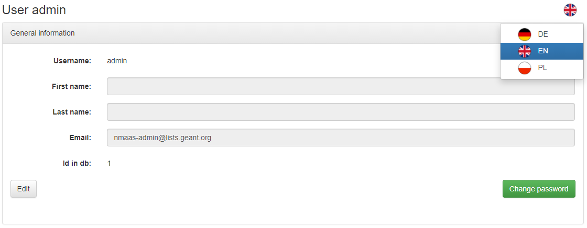
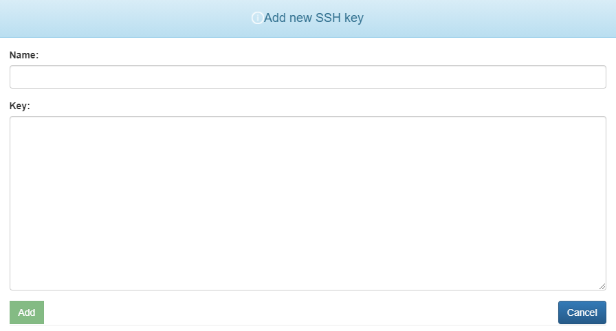
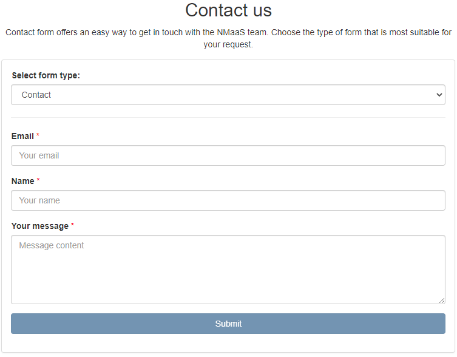

# User Guide

!!! warning Work in Progress
    This guide is currently a work in progress. Some sections might be missing or contain incomplete information.

## 1. NMaaS Domains

A domain in NMaaS corresponds to a dedicated and isolated tenant environment created within the system for particular institution, project, team or in general a group of users.

!!! info "Domain Assignment"
    User can be assigned to multiple domains.

!!! info "Requesting a New Domain"
    In order to apply for a new domain creation submit the form available at https://nmaas.eu/about?type=NEW_DOMAIN_REQUEST.

## 2. Introduction to NMaaS User Roles

NMaaS specifies user roles on two levels: global (system) level and user domain level.

Roles on each level can be assigned independently. 

### 2.1. Global Level Roles

The *Guest* default global role assigned to each user after successful account registration or first federated login allows the user to browse, comment and rate the offered applications (even without being assigned to any of the domains).

The remaining roles on the global level are:

 - **Operator** - allows the user to view domain details and update status of particular DCN network upon its manual configuration or de-configuration
 - **Application manager** - allows the user to add new applications and/or application versions to the offer through dedicated form built in the Portal as well as manage applications for which the System administrator assigned user as an owner
 - **System administrator** - gives the user the complete system administration rights in the Portal (including user, domain and application management)

!!! info "Additional Information"
    For Application manager and Domain administrator user guides visit [NMaaS Application Manager Guide](./application-manager-guide.md) and [NMaaS Domain Admin Guide](./domain-admin-guide.md)

### 2.2 Domain Level Roles 

There are three user roles defined at the domain level:

 - **Guest** - a basic role in given domain that allows the user to view the list of subscribed applications and currently deployed application instances however user is not allowed to view details any of running application instances
 - **User** - with this role user is allowed to view details of running application instances including the access and configuration options
 - **Domain administrator** - gives full control over the application subscriptions and application instances (including deployment, configuration and access) within given domain, also allows for user role management (within the scope of particular domain)

These roles are assigned per user domain. A single user may have different roles assigned in multiple domains.

!!! info "Permission Hierarchy"
    On the domain level, a higher role always includes all the permissions specified for all underlying lower level roles

!!! info "VPN Requirements"
    In order to access the applications running within a particular domain user needs to connect to a dedicated VPN that is being set up independently of the user account within the Portal

## 3. NMaaS Portal

NMaaS web-based graphical user interface can be accessed by browsing to address https://nmaas.eu.

NMaaS landing page contains a basic set of information about the NMaaS concept and the service. Users are required to log in to gain access to the actual application market.

The NMaaS Portal in available in four languages including English, French, German and Polish (though still not all texts might be properly translated in languages apart from English).

### 3.1 About

The About page available from the top bar menu contains information about current and past NMaaS software versions and a contact form being the preferred way of reaching out to the NMaaS team regarding any subject.

## 4. User Login 

The user login form is available on the right side of the top bar menu.

There are two login options to enter the Portal. First is to fill in credentials of a local user account created in the system: username and password and then clicking the `Login` button.

The second option is to use an existing account from one of the IdPs federated under eduGAIN. After clicking on the `Federated login` button, user will be redirected to the eduGAIN authorization page. If performed for the first time, user is asked to provide additional information about his account including mandatory and unique username and email address.

Users with accounts created directly in the system through the registration form are able to recover their password by clicking on the `Forgot password` link. A new input field will be displayed to provide the email address used during the registration to which a reset password link will be sent.

!!! info "Federated Login"
    The federated login option is preferred and should be used whenever possible

## 5. User Registration

For creating local account user has to select the `Register` tab in the login window.

Registration form contains several mandatory fields, which are: `Username`, `Password`, `Confirm password` and a valid `Email address`.

The provided `Username` has to be at least 3 letters long.

The user also has to confirm that he has read the NMaaS Privacy Notice text.

There are also few optional fields, namely `First name`, `Last name` and `Domain selection`.

After submitting the registration form, user has to wait for the account being activated by the administrator. The user will be notified with an email that their account is active.

A user needs to be assigned a specific role within particular domain in order to be able to view and deploy application instances in this domain.

## 6. Application Market

After the user account has been activated by the NMaaS administrator (in the case when the user submitted the registration form), they are able to log in and are granted a basic access to the main NMaaS applications view. Same access rights are granted to users that log in through eduGAIN for the first time.

On the `Applications` tab all of the applications supported by NMaaS are enlisted. Applications can be filtered by tags and sorted by few criteria. User can also search them by name.

Single application tile consists of the logo, name, brief description and current rating of the application. Clicking on a tile redirects the user to the application’s details page.

!!! info "Domain Selection"
    User needs to verify or select a proper Domain from the selector located on the top bar menu

## 7. Application Subscriptions and Instances 

Once a user is granted a role inside a particular Domain they are able to view the content of the `Subscriptions` tab. This view comprises applications subscribed for his domain by a Domain administrator. Only these applications can be further deployed in the NMaaS cloud within the scope of particular domain.

In order to subscribe to a given application user needs to open the details view of chosen application and click the `Subscribe` button.

!!! info "Application Subscriptions"
    The subscribe option is only available for users with the *Domain administrator* role

The third tab present on the top navigation bar named `Instances` contains information about all the application instances deployed within user’s domain. By default the displayed list of application instances only includes instances deployed by given user. It is possible to display all instances in given domain by selecting `All` in the `Show` selector. In addition it is possible to display all the instances that were already undeployed and which are hidden by default.

Application instances are described by custom Name assigned during deployment, name of the `Application`, selected `Version` of the application, user being the `Owner` of this instance (user who initiated the deployment), `Deployment time` and current `State`.

## 8. Application Instance Deployment

### 8.1 Application Details View

On the application details page user can view a basic description of the application, example screenshots of the user interface, references to its website, code repository, website for registering issues and the versions of the application currently available on NMaaS.

A user can rate an application by selecting the appropriate number of stars, view the average rating and the rating breakdown. They can also add comments for this application.

Users can deploy instances of selected (subscribed) application clicking the `Deploy` button.

!!! info "Application Deployment"
    Deploy option is only available for users with the `Domain administrator` role

### 8.2 Initiating Application Instance Deployment

When deploying a new application instance a user is requested to provide or select:

 - custom instance name (unique within the domain, up to 10 lowercase characters)
 - version of the application (from a drop down menu)
 - chose to enable or not fully automatic application upgrades (triggered when new versions become available in the Portal)
 - domain (in which given instance should be deployed)

The installation process comprises few steps including subscription validation, environment creation, verifying connectivity, application deployment, application first time configuration and activation.

Once the installation process is completed the user is provided with a way or multiple ways of accessing the deployed application instance depending on the application (in majority of cases a link for accessing the web-based UI).

!!! info "Importance of the Provided Instance Name"
    Providing a suitable instance name is important since it is later on used to create a FQDN unique for this application instance following pattern: `<instance name>.<user domain name>.<NMaaS base domain>` (e.g. vminstance.pllab.nmaas.eu)

!!! info "Application Deployment Notifications"
    User is notified with an email once the new application instance becomes available

### 8.3 Application Instance Initial Configuration

During the installation process, once the application instance is initially deployed, the user is asked to provide a initial configuration parameters for the application that is being installed. This data is entered through a configuration wizard presented in a window after clicking the `Configure` button which becomes visible on the application instance details page once the application transits to `Deployed` state.

Different type of data may be required depending on the application. Typically the user is requested to provide credentials for a default account to be created at application startup or basic set of information about the equipment to be monitored by this application instance. Configuration parameters to be filled in are distributed over two or three tabs depending on the application.

Once all required fields are populated user can select the *Apply configuration* button to proceed with the application activation process.

### 8.4 Accessing Application Instance

Once the application instance reaches the `Active` state it can be accessed by the user.

Multiple access methods are supported by NMaaS and each of the applications supports one or more of them.

Four types of access are possible:

 - **public** - application user interface is accessible directly from the public Internet
 - **external** - application user interface is accessible over HTTPS from within a dedicated client VPN
 - **internal** - application is accessible over a different protocol than HTTP on a dedicated IP address (assigned by the system) and application specific port
 - **local** - a Kubernetes service name that can be used to access this application instance from another application instance running within the same user domain (e.g. the local access information for a Prometheus instance can be used to configure data source in Grafana instance deployed within the same domain)

!!! info "Single Access Method"
    If a given application supports only a single external access option then when selecting the *Access* button user will be redirected to the application interface directly

!!! info "VPN Requirement for Accessing Deployed Applications"
    In order to access the applications running within a particular domain user needs to connect to a dedicated VPN

### 8.5 Configuring Application Instance

Some of the applications support the option of updating their configuration during application instance runtime.

In such case, when instance is in `Active` state, the `Configure` button from the Actions menu on the application instance details page should be used to open a window presenting the configuration options.

Typically a `git clone` link is provided that can be used by the user to locally clone the git repository created specifically for this application instance. 

Then user can apply the desired changes to the pre-propulated configuration files added to the repository by default or add new additional files.

After the files are committed and pushed back to the repository the configuration of the respective application is automatically reloaded within a couple of minutes.

!!! info "Accessing the Configuration Repositories"
    When cloning, the user is authenticated using their private SSH key therefore is it necessary to upload the public SSH key on the user's `Profile` page prior to accessing the repository

!!! info
    The user that initiates a given application instance deployment is automatically added to GitLab as a member of the newly created repository.
    Other users, in order to have the same SSH-based access to the repository, have to be added as members to particular application instance using the `Members` button from the `Actions` menu. This operation can be performed by a Domain administrator. A Domain administrator can only select users that are added to their domain and have previously uploaded their SSH keys (see [section 9.3](./user-guide.md#93-setting-user-ssh-keys)).

### 8.6 Managing Application Instance Upgrades

Once an application instance is already running, the user is able to alter their choice regarding enabling automatic application upgrades using proper option available in the `Actions` menu. If during the initial deployment request user opted not to enable the upgrades he is provided with an option to `Enable automatic upgrades` and vice versa.

In case the automatic upgrades were not enabled, the user is still able to trigger application instance upgrades manually once a newer version of his deployed application is made available in the marketplace. In order to trigger the upgrade user should click on the `Upgrade` button from the `Actions` menu. Once clicked a window is displayed presenting detailed information about the possible upgrade to be performed including target application versions and corresponding target Helm chart version. Once confirmed, the upgrade process begins in the background.

The fact that a particular application instance can be upgraded is indicated on the `Instances` view by an up arrow icon displayed next to application instance.

!!! info "Upgrade Availability Notifications"
    User is notified with an email once a manual upgrade of any of his running application instances becomes possible

!!! info "Successful Update Notification"
    User is notified with an email once the upgraded application instance becomes active

### 8.7 Initiating Application Instance Removal

In order to shutdown a particular application instance and free up resources that are no longer in use, user should click the `Undeploy` button from the `Actions` menu and confirm the action in window that pops up.

### 8.8 Managing Failed Application Instance Deployments

In unforeseen situations the deployment process may fail at some stage. 

One of the following actions can be triggered by the user from the application instance view once deployment process ends up in `Failure` state:

 - **Check state** - verifying if application instance is already running 
 - **Redeploy** - attempt to re-run the deployment process
 - **Remove** - complete removal of the failed instance allowing a fresh deployment with the same custom instance name

!!! info "Requesting Support for Failed Deployments"
    Administrators are notified with an email automatically once an application deployment process fails. 
    Users are encouraged to additionally inform administrators about the incident using the Contact Form.

## 9. User Settings

### 9.1 User Profile

A User can view their account details and other personal settings by selecting the `Profile` option from the drop-down menu displayed after hovering over the username field on the top navigation bar.

The Profile view contains user account information such as: `Username`, `First name`, `Last name` and `Email`.

On the bottom of the page the user can also see their roles granted in particular domains.

By clicking on the flag icon located in the top right section of the view the user can select their preferred language in which the content of the Portal will be displayed.

### 9.2 Setting a User's Default Domain

One of the available options on the user's `Profile` view is specifying user's default domain.

This setting is particularly useful if a given user belongs to multiple domains and would like a specific domain to be selected by default after login.

### 9.3 Setting User SSH Keys

For applications that support the Git-based configuration management model, meaning the possibility to update the application configuration during runtime by pushing updated configuration files to a dedicated Git repository, it is required that all users willing to use this option upload their public SSH keys using the form available on the `Profile` view.

Upon key upload or update in the Portal, user information is synchronized with the user account created on the GitLab instance associated with given NMaaS installation.

### 9.4 Password Change

On clicking the `Change password` button, a new window will be displayed where the user can change their own password (see picture below).

!!! info "Password Reset Availability"
    This option is not available for users that log in using the Federated / SSO option

## 10. Contact Form

An easy and recommended way for contacting the NMaaS Team is through the Contact Form.

The Contact Form is available on the About page along with the information about the versions of the NMaaS software.

The user can select one of five form types that best matches the subject of his message:

 - **Contact** - generic request form
 - **Access request** - for requests related with new account creation or role assignment
 - **Issue report** - for reporting any encountered issues with the Portal or deployed application instances
 - **New domain request** - for requests related with new domain creation
 - **Enhancement or new application request** - for placing suggestions of enhancements, new features or integration of new applications 

!!! info "Form Fields"
    Each type of form contains a different set of mandatory fields to be populated to best describe the subject of the message
